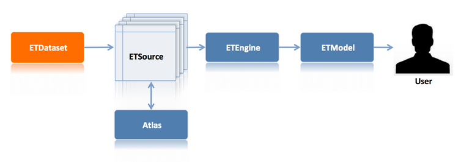

# ETDataset - carriers source analyses

The [ETDataset](https://github.com/quintel/etdataset-public) is a repository that includes all the input data of the [ETModel](https://github.com/quintel/etmodel). This data can apply to:

1. A country's energy system 
- Energy technologies (like electric cars)
- Energy carriers (like fuels)

Needless to say the data of **type 1** are **country specific**, i.e. they vary per country, as far as data and sources are concerned. Almost all **data of types 2 and 3** are **global** as far as the Energytransition model is concerned. That means each country mostly uses the same parameters for energy technologies and carriers. Whenever this is not the case, the documentation for a carrier will state so clearly.

Once the [ETDataset](https://github.com/quintel/etdataset-public) is completed, it needs to be exported to [ETSource](https://github.com/quintel/etsource)  from where the **Input Data** will be used in calculations by [ETEngine](https://github.com/quintel/etengine). The user can interact with the model through the front-end of the [ETM](http://www.et-model.com) that is maintained in the [ETModel](https://github.com/quintel/etmodel) repository.

This **carriers_source_analyses** repository contains Excel files for the most relevant energy carriers that are used in the [ETModel](https://github.com/quintel/etmodel). The carriers_source_analyses repo documents all the parameters of the carriers, including which sources were used. Once a carriers_source_analysis is completed, it needs to be exported to [ETDataset](https://github.com/quintel/etdataset-public), from where will be exported to [ETSource](https://github.com/quintel/etsource). This is presently still done by hand, but will be automated to use VBA scripts, just like the nodes_source_analyses.

### Fuel Chain Emissions
For the Dutch dataset the Energy Transition Model can also perform life cycle analyses or fuel chain emission calculations for the following carriers:

- Coal
- Crude oil
- Natural gas
- Liquid biofuels
- Green gas (upgraded biogas)
- Wood pellets
- Uranium oxide

For this reason the Dutch dataset contains additional parameters for these carriers. For now we have documented these numbers in the same carrier analyses as the global carrier parameters used by the Energy Transition Model. The carrier source analysis files will look a little different for these carriers.
